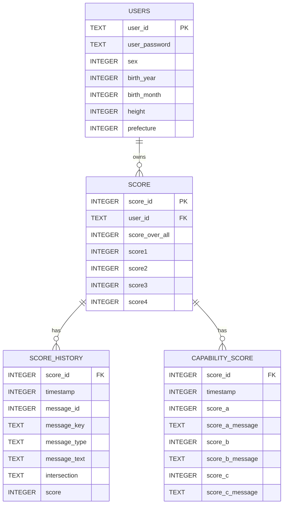

# ER図 — driving-score.db

## 概要
仕様書 4 ノード（score model / score repository / user model / user repository）から、`driving-score.db` に存在するテーブルを抽出しました。

- 実 DB テーブル: `users`, `score`, `score_history`, `capability_score`
- リレーションは `score_id` を軸とした 1:N が中心（明示的な外部キー制約は SQLite 上定義されていないが、仕様書の記述に基づき論理 FK として記載）

## リレーション定義

| 親 | 子 | 種別 | キー | 根拠 |
|---|---|---|---|---|
| USERS | SCORE | 1:N | `users.user_id` → `score.user_id` | score テーブルに `user_id TEXT`、SELECT で `WHERE user_id = ?`、delete が user_id 単位で連鎖削除 |
| SCORE | SCORE_HISTORY | 1:N | `score.score_id` → `score_history.score_id` | 仕様書に「FK to score.score_id」明記、INNER JOIN ON score_id |
| SCORE | CAPABILITY_SCORE | 1:N | `score.score_id` → `capability_score.score_id` | INNER JOIN ON score_id、score_id 単位で連鎖削除 |

## 補足・注意事項

- **PK について**
  - `users.user_id` は `TEXT PRIMARY KEY`（明示）。
  - `score.score_id` は `INTEGER PRIMARY KEY`（診断開始タイムスタンプ）。
  - `score_history` / `capability_score` にはテーブル定義上 PRIMARY KEY 宣言がないため PK は付与していません（`score_id` は FK として保持）。

- **FK 制約について**
  - SQLite の CREATE TABLE 文には `FOREIGN KEY` 句が定義されていません。上記 FK は仕様書の記述（「FK to score.score_id」「JOIN ON score_id」「連鎖削除順序」）から読み取れる**論理的な参照関係**です。
  - `score.user_id` → `users.user_id` も同様に、明示的 FK 制約はなく論理参照です。

- **型の表記**
  - Mermaid の構文制約により、`INTEGER(11)` 等の桁指定・括弧は使用不可のため、DDL 上の宣言型（`INTEGER` / `TEXT`）のみを記載しています。
  - 実際には `score*` 系カラムや `height` は INTEGER 宣言でも小数値が格納され得る点は仕様書に記載の通りです（ER 図上は宣言型を採用）。

- **モデルクラス（Message / CapabilityScore / Score / User）** はドメインモデルであり物理テーブルではないため、対応する物理テーブル（`score_history` ⇔ Message、`capability_score` ⇔ CapabilityScore、`score` ⇔ Score、`users` ⇔ User）に集約して表現しています。