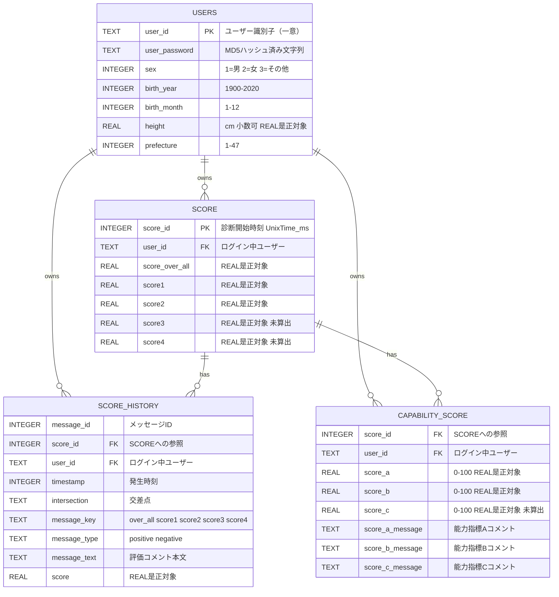

## ER図（DBドメイン集約）



---

## 補足説明

### 1. データベース
- DB ファイル: `driving-score.db`（SQLite / Cordova SQLite プラグイン経由）
- テーブルは 4 つ: `users` / `score` / `score_history` / `capability_score`

### 2. 主キー・参照関係

| テーブル | PK | FK | 備考 |
|---|---|---|---|
| `users` | `user_id`（TEXT PRIMARY KEY） | — | 仕様書に明記された唯一の宣言的 PK |
| `score` | `score_id`（診断開始 UnixTime ms、同一ユーザー内で一意） | `user_id` → `users` | 「PK 相当」と記載（宣言的 PK の記述は仕様書になし） |
| `score_history` | （未記載） | `score_id` → `score`、`user_id` → `users` | Message モデルに対応 |
| `capability_score` | （未記載） | `score_id` → `score`、`user_id` → `users` | 現行は 3 列・0〜100 REAL |

> **注**: 仕様書には「外部キー制約は宣言していない。`score` / `score_history` / `capability_score` は `user_id` によって**論理的に** `users` を参照する」と明記されています。上記 FK は DDL 上の制約ではなく**論理参照**です。

### 3. カーディナリティの根拠

- `USERS ||--o{ SCORE`：走行（診断 1 回）ごとに `score` 1 件を保存。参照・削除はすべてログイン中 `user_id` でスコープ。
- `SCORE ||--o{ SCORE_HISTORY`：`insertScore` で 1000 レコード刻みのバルク INSERT を行うため 1:N。
- `SCORE ||--o{ CAPABILITY_SCORE`：同じくバルク INSERT 対象であり、`Score.graphCapabilityScoreList`（配列）が存在するため 1:N として記述。
  - ただし `db.score.model` には「Score / Message / CapabilityScore は score / score_history / capability_score と 1:1 で対応する」との記述もあります。これは**モデルクラスとテーブルの対応関係**を指す記述と解釈しました（→ 未確定事項、下記参照）。

### 4. 型に関する注記（Mermaid 構文制約への対応）
仕様書上の実型は以下のとおりです（Mermaid の型名には括弧・カンマが使えないため簡略表記）。

- `REAL`：`users.height`、`score.score_over_all` / `score1`〜`score4`、`score_history.score`、`capability_score.score_a` / `score_b` / `score_c`
  - すべて **`db.schema.corrections` の REAL 是正対象**（旧 INTEGER 宣言からの是正）
  - 保存は小数のまま。丸めは表示層（UI）責務
- `TEXT`：`user_id`、`user_password`（MD5）、`message_*`、`intersection`、`score_*_message`
- `INTEGER`：`sex`、`birth_year`、`birth_month`、`prefecture`、`score_id`、`timestamp`

### 5. 削除連鎖（UC05 アカウント削除）
物理削除。以下の順で `user_id` 単位に連鎖削除します（論理削除・アーカイブは行わない）。

```
capability_score  →  score_history  →  score  →  users
```

### 6. 実装実態に関する注記
- `score3` / `score4` / `capability_score.score_c` は **CAN 版で算出処理が存在せず未設定**のまま保持されます（列は存在するが実データとして意味を持たない）。
- 未算出時はスコアロジック側の既定値により **100 が保持**され、モデル初期値 `-1` と併存するため、保持値だけでは「未算出」と「満点」を判別できません。

### 7. ER 図に反映していない事項（仕様書上「未確定」のため）
以下は仕様書に「未確定」「本是正の対象外」と明記されているため、エンティティ・カラムとして追加していません。

- 6 項目・1〜5 段階の能力指標（レーダーチャート要求）に伴う列拡張／新テーブル
- 項目別評価コメント（最大 6 件/走行）の保存要否
- 履歴平均の集計値保存（現行は都度算出、テーブルに保持しない）
- ヒヤリポイント／ヒヤリ個別動画（前後 15 秒）のメタデータ保持テーブル
- CAN データの確認用保存テーブル
- GPS 用テーブル／カラム（投入経路側の責務、本ノード非対象）

### 8. 図として確定できなかった点（open question）
1. `score_history` / `capability_score` の **PK（宣言的主キー）** が仕様書に記載されていない。
2. `score` ↔ `capability_score` の多重度（1:1 か 1:N か）が、モデル記述とバルク INSERT 記述で解釈が分かれる。
3. `score` テーブルに `hiyari` / `intersection` 相当の列が存在するかは仕様書に明記がない（モデル `Score` にはフィールドが存在するが、`makeDbScore` は `score_id` / `score_over_all` / `score1..4` のみを復元対象として記載）。そのため図には含めていません。