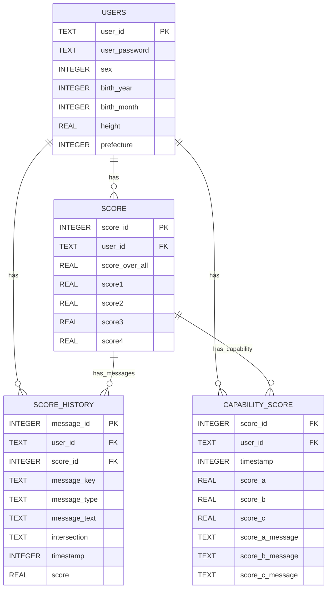

## 補足説明

### エンティティの出典
| エンティティ | 出典ノード | 備考 |
|---|---|---|
| `USERS` | db.user.repository（CREATE TABLE 明記） | 唯一 DDL が仕様本文に記載されているテーブル |
| `SCORE` | db.score.repository / db.score.model（`makeDbScore`） | カラムは `makeDbScore` が読む `score_id / score_over_all / score1..4` に限定 |
| `SCORE_HISTORY` | db.score.repository / db.score.model（`makeDbMessage`） | `Message` と 1:1 対応 |
| `CAPABILITY_SCORE` | db.score.repository / db.score.model（`makeDbCapabilityScore`） | `CapabilityScore` と 1:1 対応 |

### 型について
- `users.height`、および `score.score_over_all` / `score1..4`、`score_history.score`、`capability_score.score_a/b/c` は **db.schema.corrections §5 の REAL 是正対象**（小数を丸めず保持）。
- 上図の型名は Mermaid 構文制約により桁指定なしで記述（`TEXT` / `INTEGER` / `REAL`）。

### キー・リレーションの根拠
- `users.user_id` は「TEXT PRIMARY KEY」と DDL に明記。
- `score.score_id` は「診断開始の UnixTime(ms)、PK 相当」「同一ユーザー内で重複しない前提」と記載されており、PK として記述した。ただし *同一ユーザー内* での一意性という記述であるため、実際に `(user_id, score_id)` の複合 PK かは仕様上未確定（下記参照）。
- `score_history` / `capability_score` は「`score_id` を介して `score` を参照する」と明記されているため FK として記述。
- 3 テーブルすべてが「ユーザー単位で削除される」「userId でスコープされる」と記載されているため、`users` から各テーブルへの 1:N を記述。
- `SCORE → SCORE_HISTORY` / `SCORE → CAPABILITY_SCORE` は、`insertScore` が両テーブルへ「1000 レコード刻みのバルク INSERT」を行う記述から 1:N とした。

### 仕様上未確定のため図に反映していない点
- **`score_history` / `capability_score` の PK 定義**：仕様に PK 記述がなく、`message_id` を PK として仮置きしている（`capability_score` には PK 相当の記述が一切ないため FK のみ）。
- **複合 PK / UNIQUE 制約**：`score_id` の一意性スコープ（ユーザー内か全体か）が未確定。
- **外部キー制約の宣言有無**：db.user.repository は「外部キー制約は宣言していない（論理的な参照）」と明記。上図の FK は *論理参照* を示す。
- **`score.hiyari` / `score.intersection`**：モデル（`Score`）には存在するが、`makeDbScore` の復元対象カラムとして仕様に列挙されていないため、カラムとして追加していない。
- **走行コメントの格納先**：db.score.repository の open_question に「`score` の列か別テーブルか未確定」と記載があるため、コメント用カラムは追加していない。
- **`score3` / `score4` / `score_c`**：列としては存在するが、CAN 版では算出処理がなく既定値 100 のまま保存される（db.score.model の実装実態）。