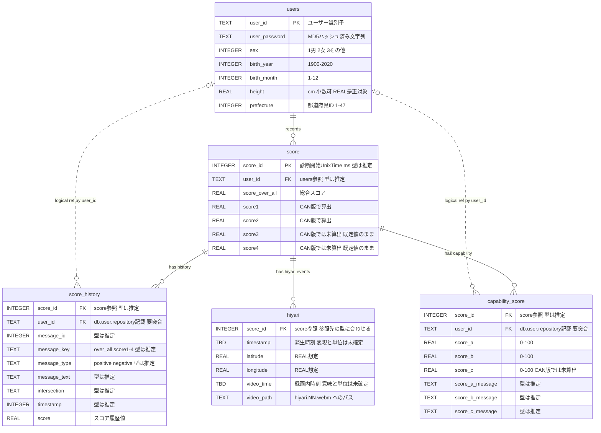

```mermaid
erDiagram
    users ||--o{ score : "records"
    score ||--o{ score_history : "has history"
    score ||--o{ capability_score : "has capability"
    score ||--o{ hiyari : "has hiyari events"
    users |o..o{ score_history : "logical ref by user_id"
    users |o..o{ capability_score : "logical ref by user_id"

    users {
        TEXT user_id PK "ユーザー識別子"
        TEXT user_password "MD5ハッシュ済み文字列"
        INTEGER sex "1男 2女 3その他"
        INTEGER birth_year "1900-2020"
        INTEGER birth_month "1-12"
        REAL height "cm 小数可 REAL是正対象"
        INTEGER prefecture "都道府県ID 1-47"
    }

    score {
        INTEGER score_id PK "診断開始UnixTime ms 型は推定"
        TEXT user_id FK "users参照 型は推定"
        REAL score_over_all "総合スコア"
        REAL score1 "CAN版で算出"
        REAL score2 "CAN版で算出"
        REAL score3 "CAN版では未算出 既定値のまま"
        REAL score4 "CAN版では未算出 既定値のまま"
    }

    score_history {
        INTEGER score_id FK "score参照 型は推定"
        TEXT user_id FK "db.user.repository記載 要突合"
        INTEGER message_id "型は推定"
        TEXT message_key "over_all score1-4 型は推定"
        TEXT message_type "positive negative 型は推定"
        TEXT message_text "型は推定"
        TEXT intersection "型は推定"
        INTEGER timestamp "型は推定"
        REAL score "スコア履歴値"
    }

    capability_score {
        INTEGER score_id FK "score参照 型は推定"
        TEXT user_id FK "db.user.repository記載 要突合"
        REAL score_a "0-100"
        REAL score_b "0-100"
        REAL score_c "0-100 CAN版では未算出"
        TEXT score_a_message "型は推定"
        TEXT score_b_message "型は推定"
        TEXT score_c_message "型は推定"
    }

    hiyari {
        INTEGER score_id FK "score参照 参照先の型に合わせる"
        TBD timestamp "発生時刻 表現と単位は未確定"
        REAL latitude "REAL想定"
        REAL longitude "REAL想定"
        TBD video_time "録画内時刻 意味と単位は未確定"
        TEXT video_path "hiyari.NN.webm へのパス"
    }
```

## 補足説明

### エンティティ一覧

| テーブル | 出典ノード | 概要 |
|---|---|---|
| `users` | db.user.model / db.user.repository | ユーザー情報。`CREATE TABLE` がそのまま記載されている |
| `score` | db.score.model / db.score.repository | 走行（診断）1回分の総合スコアと項目別スコア |
| `score_history` | db.score.model / db.score.repository | 時系列スコア履歴と評価メッセージ（モデル上は `Message` に対応） |
| `capability_score` | db.score.model / db.score.repository | 能力指標 A/B/C（3列・0〜100 REAL） |
| `hiyari` | db.hiyari.model / db.score.repository | ヒヤリ事象（1件1行） |

### リレーション

| 親 | 子 | 多重度 | 根拠 |
|---|---|---|---|
| `users` | `score` | 1 : 0..N | `score.user_id` を条件に削除する SQL（db.score.repository §8） |
| `score` | `score_history` | 1 : 0..N | `score_id` で参照し、1000レコード刻みでバルク INSERT する |
| `score` | `capability_score` | 1 : 0..N | `score_id` で参照し、1000レコード刻みでバルク INSERT する |
| `score` | `hiyari` | 1 : 0..N | `score_id` で参照する（db.hiyari.model §5、db.score.repository §5） |
| `users` | `score_history` / `capability_score` | 論理参照（点線） | db.user.repository の「`user_id` によって論理的に `users` を参照」という記載による。FK 制約は宣言しない |

### 型の記載方針
- **仕様書に型が明記されている列**は、その型をそのまま使っています（`users` 全列、スコア系 REAL、`latitude` / `longitude` の REAL 想定、`video_path` の文字列）。
- **型が明記されていない列**は、モデルの TypeScript 型（`number` / `string`）や意味（UnixTime(ms) など）から SQLite の型を推定しました。これらの列にはコメントで「型は推定」と付けています。
- **型そのものが未確定と明記されている列**（`hiyari.timestamp` / `hiyari.video_time`）は `TBD` としています。

### 仕様書間の不整合・未確定事項（ER 図に影響するもの）
1. **`hiyari` の主キー**: 代理キー（行 ID）の要否が未確定です（db.hiyari.model §13-5）。このため PK を付けていません。
2. **`score_history` / `capability_score` の `user_id`**: 次の2つの記述が食い違っています。
   - db.user.repository: 「`user_id` 一致の全行を削除する」「`user_id` で `users` を参照する」
   - db.score.repository: `score_id` を介して `score` を参照する
   
   列が実在するかは既存の `CREATE TABLE` と突合する必要があります。
3. **`score_history` の列構成**: `makeDbMessage` が読む SELECT 結果の列（`message_id` 等）から起こしました。3段 JOIN の結果である可能性があるため、実テーブルの列であるかは要確認です。
4. **`capability_score` の多重度**: モデル上は Score 1件に対して CapabilityScore は1件です。一方、リポジトリ仕様ではバルク INSERT と記載されています。このため 0..N としました。
5. **`score` の PK**: モデル仕様の「`score_id` を採用（PK 相当）」という記載に基づいて PK としています。
6. **`capability_score` の列**: `score_a_message` 以降は「`score_a_message/…`」という省略表記から補完しました。
7. **図に含めていないもの**（仕様上で未確定、または対象外のため）:
   - 6項目・5段階の能力指標テーブル
   - 履歴平均の集計テーブル（都度算出と明記されている）
   - CAN データ保存テーブル
   - GPS 用テーブル
   - `settings` テーブル（テーブル定義の記載がない）
   - ヒヤリ動画ファイル `hiyari.NN.webm`（DB 外のファイル。`video_path` で参照するのみで、DB の FK ではない）